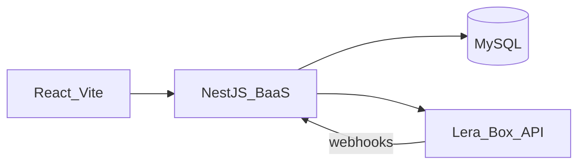

# BaaS VBA Systems

Aplicação **Banking as a Service** para lojistas: checkout Pix e cartão, carteira, extrato, saques e webhooks. O **NestJS** orquestra o produto; o **Lera Box** (BranchPay) processa pagamentos via HTTP.

| | |
|---|---|
| **Repositório** | [github.com/Atanazio01/baas](https://github.com/Atanazio01/baas) |
| **Front (produção)** | [baas.mddev.com.br](https://baas.mddev.com.br) |
| **API (produção)** | [baas-api.mddev.com.br](https://baas-api.mddev.com.br) |
| **Swagger BaaS** | [baas-api.mddev.com.br/docs](https://baas-api.mddev.com.br/docs) |
| **Swagger Lera** | [api.branchpay.com.br/docs](https://api.branchpay.com.br/docs) |

---

## Arquitetura



| Camada | Responsabilidade |
|--------|------------------|
| **BaaS (Nest + MySQL)** | Usuários, JWT, checkout links, orders, webhooks, espelho de transações |
| **Lera Box** | Pix, cartão, wallet, fees, saques — fonte da verdade financeira |
| **React** | Painel do lojista + checkout público |

Integração **somente via HTTP** — sem acesso ao banco do gateway.

---

## Stack

| Camada | Tecnologias |
|--------|-------------|
| Backend | NestJS, TypeScript, TypeORM, MySQL, class-validator, Swagger |
| Frontend | React, Vite, TanStack Query, Tailwind CSS |
| Infra | Docker Compose, pnpm |

---

## Estrutura do repositório

```
baas/
├── api/                 # NestJS — API BaaS
├── web/                 # React + Vite — interface do lojista
├── docker-compose.yml   # MySQL + API + front
├── .env.example         # template de variáveis
└── README.md
```

---

## Pré-requisitos

- **Docker** e **Docker Compose** (caminho recomendado)
- Opcional (dev local): **Node.js 22+**, **pnpm 9+**, MySQL 8

---

## Setup rápido — Docker

```bash
git clone git@github.com:Atanazio01/baas.git
cd baas

cp .env.example .env
# Edite .env — veja seção "Variáveis de ambiente" abaixo

# Gere a chave de criptografia do token Lera (obrigatória):
openssl rand -base64 32
# Cole o resultado em GATEWAY_ENCRYPTION_KEY no .env

docker compose up -d --build
```

Aguarde ~30s para o MySQL ficar healthy, então acesse:

| Serviço | URL local |
|---------|-----------|
| Front | http://localhost:8080 |
| API | http://localhost:3000 |
| Swagger | http://localhost:3000/docs |

### Rebuild do front após mudar `.env`

`VITE_API_URL` é embutida no build do Vite. Se alterar URLs:

```bash
docker compose build web --no-cache && docker compose up -d web
```

---

## Setup dev local (opcional)

### API

```bash
cd api
pnpm install
cp ../.env .env   # ajuste DB_HOST=127.0.0.1 se MySQL local
pnpm start:dev
```

### Web

```bash
cd web
pnpm install
echo "VITE_API_URL=http://localhost:3000" > .env
pnpm dev
```

MySQL precisa estar acessível (container Docker ou instalação local na porta 3306).

---

## Variáveis de ambiente

Copie [`.env.example`](.env.example) para `.env`. **Nunca commite `.env`.**

| Variável | Obrigatória | Descrição |
|----------|:-----------:|-----------|
| `MYSQL_ROOT_PASSWORD` | sim | Senha root do container MySQL |
| `DB_NAME` | sim | Nome do banco (`baas`) |
| `DB_USER` / `DB_PASSWORD` | sim | Usuário MySQL da aplicação |
| `JWT_SECRET` | sim | Assinatura dos JWTs do painel BaaS |
| `JWT_EXPIRES_IN` | não | Expiração JWT (padrão `7d`) |
| `GATEWAY_BASE_URL` | sim | Base URL Lera (`https://api.branchpay.com.br/api`) |
| `GATEWAY_ENCRYPTION_KEY` | sim | AES-256-GCM — 32 bytes base64 (`openssl rand -base64 32`) |
| `WEBHOOK_HMAC_SECRET` | sim* | Secret dos webhooks Lera (*obrigatório se usar webhooks) |
| `API_PUBLIC_URL` | sim* | URL pública da API — Lera chama webhooks aqui |
| `FRONTEND_URL` | sim | Base URL do front — links de checkout em e-mails |
| `VITE_API_URL` | sim | URL da API no build do front |
| `RESEND_API_KEY` | não | API Resend — envio de link por e-mail |
| `EMAIL_FROM` | não | Remetente dos e-mails |

**Exemplo — Docker local:**

```env
FRONTEND_URL=http://localhost:8080
VITE_API_URL=http://localhost:3000
API_PUBLIC_URL=http://localhost:3000
```

**Exemplo — produção:**

```env
FRONTEND_URL=https://baas.mddev.com.br
VITE_API_URL=https://baas-api.mddev.com.br
API_PUBLIC_URL=https://baas-api.mddev.com.br
```

> **Webhooks locais:** Lera não alcança `localhost`. Para testar webhooks reais, use URL pública (VPS, ngrok) em `API_PUBLIC_URL` e reconecte a conta gateway.

---

## Fluxos principais

### 1. Conta BaaS

1. `POST /auth/signup` — cadastro no painel (e-mail + senha BaaS)
2. `POST /auth/signin` — login → JWT Bearer

### 2. Conta no gateway (Lera)

1. `POST /gateway-accounts/register` — cadastro PF/PJ no Lera (e-mail e telefone reais)
2. Receber por e-mail: documento, senha, CodigoCliente, ChaveLoja
3. `POST /gateway-accounts/connect` — documento + senha Lera (senha **nunca** fica no front)
4. Nest armazena Bearer criptografado e registra webhooks automaticamente

### 3. Checkout Pix

1. `POST /checkout-links/pix` — gera link + QR/EMV
2. Compartilhar URL: `{FRONTEND_URL}/checkout/{publicId}`
3. Pagador acessa checkout público (sem login)
4. Status atualizado por webhook `PAYMENT_PIX` (polling no front enquanto `PENDING`)

### 4. Checkout cartão

1. `GET /fees?brand=VISA` — taxas por bandeira/parcela
2. `POST /checkout-links/card` — cobrança com `feePercent` e `installments` corretos

### 5. Carteira e extrato

- `GET /wallet` — saldo (proxy Lera)
- `GET /wallet/transactions?status=&type=&limit=` — extrato com filtros

### 6. Saque

- `POST /withdrawals` — solicita saque Pix
- `GET /withdrawals/:id` — consulta status
- Webhook `WITHDRAWAL` atualiza status assíncrono

### 7. Webhooks

Receivers públicos (validação HMAC):

- `POST /webhooks/lera-box/pix`
- `POST /webhooks/lera-box/card`
- `POST /webhooks/lera-box/withdrawal`

Registro manual: `POST /webhooks/register` (JWT). Auto-registro no `connect`/`reconnect`.

---

## API BaaS — rotas principais

Documentação completa: **Swagger** (`/docs`).

| Grupo | Rotas | Auth |
|-------|-------|------|
| `auth` | `POST /signup`, `POST /signin` | Público |
| `users` | `GET /me` | JWT |
| `gateway-accounts` | `register`, `connect`, `reconnect`, `status` | JWT |
| `checkout-links` | `POST /pix`, `POST /card`, `GET /:publicId`, `send-email` | JWT / público* |
| `wallet` | `GET /`, `GET /transactions` | JWT |
| `withdrawals` | `POST /`, `GET /:id` | JWT |
| `fees` | `GET /` | Público |
| `webhooks` | `register`, `lera-box/*` | JWT / público* |

\* `GET /checkout-links/:publicId` e receivers Lera são `@IsPublic()`.

---

## Modelo de dados (MySQL)

| Entidade | Finalidade |
|----------|------------|
| `users` | Lojistas do BaaS |
| `gateway_accounts` | Vínculo + token Lera criptografado |
| `checkout_links` | Links públicos, QR, status, taxa |
| `orders` | Pedidos — conciliação por `externalReference` |
| `transactions` | Espelho local de movimentações |
| `withdrawals` | Saques |
| `webhook_events` | Auditoria, idempotência, payloads |

Valores monetários: **sempre centavos** (`1500` = R$ 15,00).

---

## Decisões técnicas

- **Auth:** `AuthGuard` global + `@IsPublic()` / `@ActiveUserId()` — JWT BaaS separado do Bearer Lera
- **Segurança gateway:** token Lera criptografado (`CryptoService` AES-256-GCM); senha Lera só no connect
- **Webhooks:** validação `X-Lera-Box-Signature`, idempotência por `transactionId`, log em `webhook_events`
- **Conciliação:** `externalReference` (`PIX-uuid`, `CARD-uuid`) alinhado ao gateway
- **Checkout público:** status no MySQL — atualizado na criação e via webhook; front faz polling
- **Erros:** `GatewayHttpClient.rethrow` traduz erros Axios para exceções Nest legíveis
- **Docker:** MySQL com healthcheck; API e front em containers separados

---

## Deploy em produção

Instância em VPS (Oracle Cloud) com:

- Docker Compose (api, web, mysql)
- Caddy como reverse proxy com HTTPS
- Domínios: `baas.mddev.com.br` (front) e `baas-api.mddev.com.br` (API)

Após alterar variáveis de URL ou secrets: rebuild dos serviços afetados (`api` e/ou `web --no-cache`).

---

## Sandbox Lera — observações

- Pix, cartão e saque podem retornar **APROVADO** ou **NEGADO** aleatoriamente
- Interface e webhooks tratam ambos os cenários
- CPF/CNPJ podem ser fictícios; **e-mail e telefone** do cadastro Lera devem ser reais
- **Não** commitar senha do gateway — credenciais demo do painel BaaS são enviadas separadamente ao avaliador

---

## Comandos úteis

```bash
# Logs
docker compose logs api -f
docker compose logs web -f

# Parar
docker compose down

# Parar e apagar volumes (reset DB)
docker compose down -v

# Rebuild só API
docker compose build api --no-cache && docker compose up -d api
```

---

## Autor

Desafio técnico **VBA Systems** — integração BaaS + Lera Box.